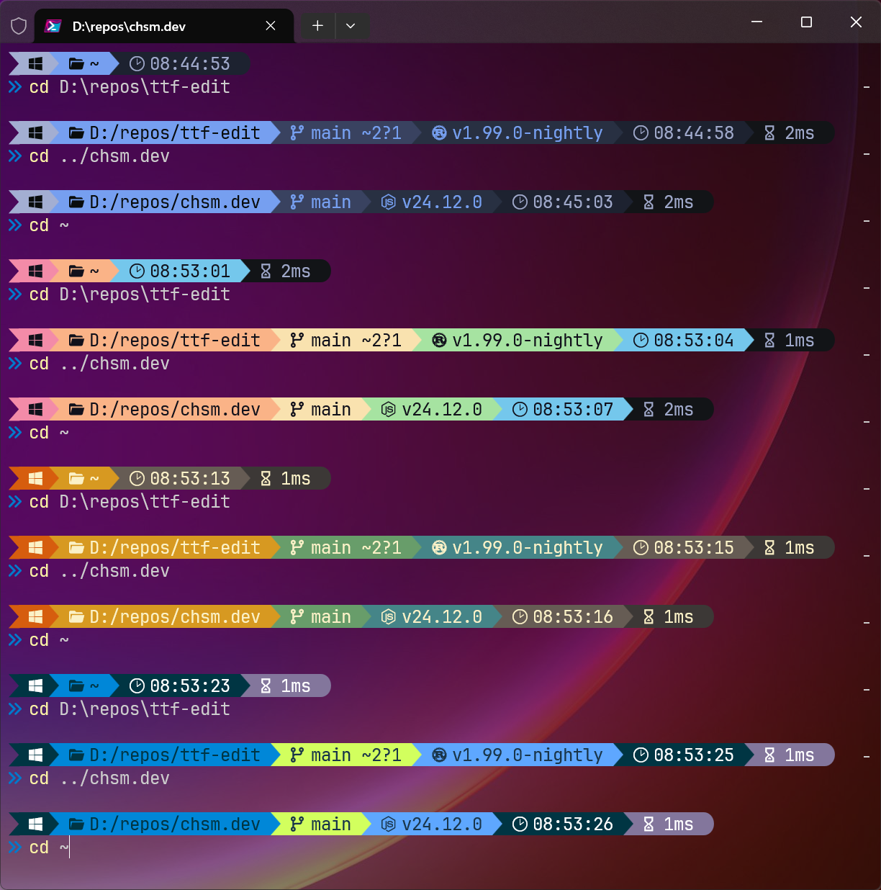

# configs-for-things

My config files for various programs that I use.


## My Espanso config

**[Espanso](https://espanso.org)** is an extensible and scriptable text expander, configurable via YAML. I use it for inserting Unicode characters, pasting various generated text, running inline scripts and converting units of measurement.

Here's a quick overview of [all the match rules](espanso/match/):

- **[150+ math symbols](espanso/match/math-stuff.yml):** `\/^`=`↑`, `\->->->`=`⇶`, `\deg`=`°`, `\mult`=`×`, `\mapsto`=`↦`, `\cbrt`=`∛`, `\floor`=`⌊⌋`, `\xor`=`⊕`, `\forall`=`∀`, `\isin`=`\memberof`=etc.=`∈`, `\integers`=`ℤ`, `\contradiction`=`⨳`, `\rightangle`=`⊾`, `\parallel`=`\||`=`∥`, `\~=`=`≈`, `\def=`=`≝`, `\>=`=`≥`, `\>>`=`≫`, `\^6\^x`=`⁶ˣ`, `\beta`=`β`, `\Omega`=`Ω`, etc.

- **[100+ combining diacritics](espanso/match/diacritics.yml):** `o\c^~`=`õ` (combining above `c^`), `o\c_~`=`o̰` (combining below `c_`), `a\'`=`á` (shortcut), `x\c^''`=`x̋`, `n\c^caron`=`ň`, `C\c^..`=`C̈`, `d\c_diaeresis`=`d̤`, `e\c_ogonek`=`ę`, `y\c^ring`=`ẙ`, `s\c_cedilla`=`ş`, etc.

- **[51 box drawing characters](espanso/match/text-and-markup.yml#L74):** `\boxtl`=`┌` (top-left `tl`), `\boxbr`=`┘` (bottom-right `br`), `\boxt`=`\boxb`=`─` (top `t`, bottom `b`), `\boxl`=`\boxr`=`│` (left `l`, right `r`), `\boxbt`=`┴` (bottom T `bt`), `\boxlt`=`├` (left T `lt`), `\box+`=`┼`, etc. Also bold/double/mixed: `\boxb…`=`┏┫┃╋┛` `\box2…`=`╔╣║╬╝`, `\box12…`=`╒╡╪╛`, `\box21…`=`╓╢╫╜`.

- **[Some text and markup stuff](espanso/match/text-and-markup.yml):** `\--`=`—`, `\...`=`…`, `\<<>>`=`«»`, `\paragraph`=`§`, `\(c)\(r)\tm`=`©®™`, `\currency`=`¤`, `\euro`=`€`, `\ruble`=`₽`, `\zws`=`​` (zero-width space), `\nbsp`=` ` (non-breaking space), `\fill`=`█`, `\fill75`=`▓`, `\fill50`=`▒`, `\fill25`=`░`, etc.

Some more complex ones with scripts:

- **[Programming utilities](espanso/match/coding.yml):** `\u16max`=`65535`, `\uint32max'`=`4'294'967'295`, `\i13min`=`-4096`, `\bin27`=`0b11011`, `\0b11011`=`27`, `\hex78`=`0x4e`, `\0x4e`=`78`, `\u1f984`=`🦄`,  `\u{1f988}`=`🦈`, `\&#128128`=`💀`, `\py{5*7/9}`=`3.888888888888889` (inline Python), `\js{[]==0}`=`true` (inline Node.js), etc.

- **[Units of measurement conversions](espanso/match/conversion.yml):** `\6ft`=`1.829m`, `\2/3m`=`2.187ft`, `\5km`=`3.107mi`, `\5lb`=`2.268kg`, `\60kg`=`132.277lb`, `\50degF`=`10°C`, `\4gal`=`18.184l`, `\1/3l`=`11.732floz`, `\27degC`=`80.6°F`, etc.


## My Kanata config

**[Kanata](https://github.com/jtroo/kanata)** is a keyboard remapper. I use it to rebind the Fn button to backslash, and the Copilot button to Right Ctrl.

```
(deflocalkeys-winiov2 fn 255)
(defsrc fn menu)
(deflayer base \ rctrl)
```

See [kanata.kbd](kanata/kanata.kbd).


## My PowerShell & Starship configs

**[Starship](https://starship.rs)** is a customizable shell prompt.



See [starship.toml](pwsh/starship.toml), [profile.ps1](pwsh/Microsoft.PowerShell_profile.ps1).


